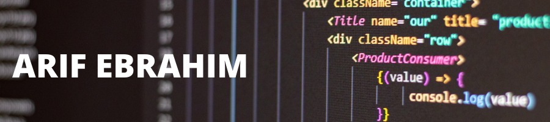

Hey there, I'm a software developer based in London. I enjoy solving difficult problems by writing clean, testable and DRY code. 

I recently graduated from Europe's leading coding bootcamp [Makers Academy](https://makers.tech/) which taught me the fundamentals of software development like **TDD, Agile software development, OOP and debugging**. I documented what I learned each week at Makers in my [Learning Log](https://github.com/ArifEbrahim/learning-log). 

I'm now loooking for my first role in tech so I can build amazing software for an innovative company.

## Projects
| Name | Description | Technologies |
| ---- | ----------- | ------------ |
| [__Tutoroom__](https://github.com/ArifEbrahim/tutoroom_fe) | Final project at Makers. A web app that allows tutors and students to connect. | React, JavaScript, CSS, JWT, Axios, Rails API |
| [__Catbook__](https://github.com/ArifEbrahim/Catbook) | A simplified clone of Facebook... but for cats. | Ruby on Rails, jQuery, PostgreSQL, HTML, CSS, RSpec, Capybara, Heroku |
| [__MakersBnB__](https://github.com/ArifEbrahim/makers_bnb) | A simplified clone of AirBnB. | Ruby, Sinatra, HTML, CSS, RSpec, Capybara |
| [__Bowling Challenge__](https://github.com/ArifEbrahim/bowling_challenge_JS) | A bowling scorecard calculator. | JavaScript, HTML, CSS, Jasmine |
| [__Blog app__](https://github.com/ArifEbrahim/blog_JS) | A full-stack Javascript app that lets you create blog posts. | JavaScript, Node, Express, MongoDB, Bootstrap |
| [__Notes app__](https://github.com/ArifEbrahim/notes_app) | A single-page JavaScript app that lets you take notes. | JavaScript, HTML, CSS, API calls |
| [__Bank tech test__](https://github.com/ArifEbrahim/bank_tech_test) | An example tech test that demonstrates the best code I can write. | JavaScript, Jest|

## Skills

  
  

